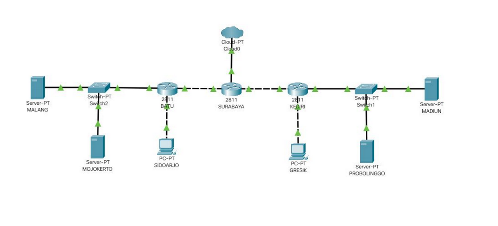
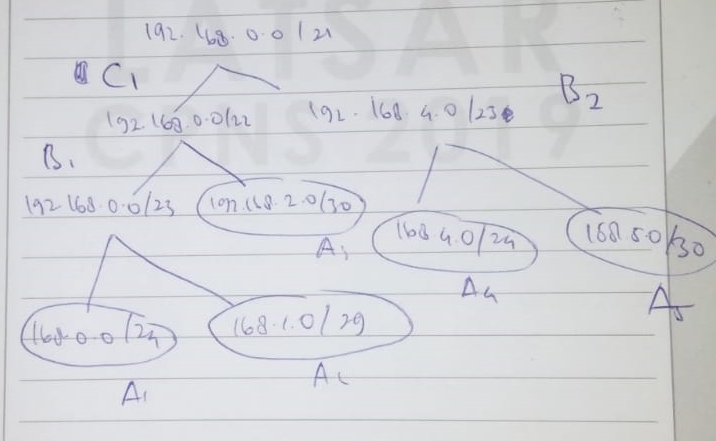

# Jarkom_Modul4_Lapres_A09

Kelompok A09:

    Iman Afandy (05111740000129)
    Nodas Uziel Putra Serpara (5111840007007)
    
 # A. Topolgoi 
 
 
 
 Isi topologi.sh : 
 
``````````` 
 # Switch
uml_switch -unix switch1 > /dev/null < /dev/null &
uml_switch -unix switch2 > /dev/null < /dev/null &
uml_switch -unix switch3 > /dev/null < /dev/null &
uml_switch -unix switch4 > /dev/null < /dev/null &
uml_switch -unix switch5 > /dev/null < /dev/null &
uml_switch -unix switch6 > /dev/null < /dev/null &

# Router
xterm -T SURABAYA -e linux ubd0=SURABAYA,jarkom umid=SURABAYA eth0=tuntap,,,10.151.78.33 eth1=daemon,,,switch5 eth2=daemon,,,switch3 mem=96M &
xterm -T KEDIRI -e linux ubd0=KEDIRI,jarkom umid=KEDIRI eth0=daemon,,,switch1 eth1=daemon,,,switch6 eth2=daemon,,,switch5  mem=96M &
xterm -T BATU -e linux ubd0=BATU,jarkom umid=BATU eth0=daemon,,,switch3 eth1=daemon,,,switch4 eth2=daemon,,,switch2  mem=96M &

# Server
xterm -T MALANG -e linux ubd0=MALANG,jarkom umid=MALANG eth0=daemon,,,switch2 mem=128M &
xterm -T MOJOKERTO -e linux ubd0=MOJOKERTO,jarkom umid=MOJOKERTO eth0=daemon,,,switch2 mem=128M &
xterm -T MADIUN -e linux ubd0=MADIUN,jarkom umid=MADIUN eth0=daemon,,,switch1 mem=128M &
xterm -T PROBOLINGGO -e linux ubd0=PROBOLINGGO,jarkom umid=PROBOLINGGO eth0=daemon,,,switch1 mem=128M &

# Klien
xterm -T GRESIK -e linux ubd0=GRESIK,jarkom umid=GRESIK eth0=daemon,,,switch6 mem=96M &
xterm -T SIDOARJO -e linux ubd0=SIDOARJO,jarkom umid=SIDOARJO eth0=daemon,,,switch4 mem=96M &


`````````````
# B. Subnetting


 
 
Isi /etc/network/interfaces : 


<h2> SURABAYA </h2> 

````
auto lo
iface lo inet loopback

auto eth0
iface eth0 inet static
address 10.151.72.42
netmask 255.255.255.252
gateway 10.151.72.41

auto eth1
iface eth1 inet static
address 192.168.2.1
netmask 255.255.255.252

auto eth2
iface eth2 inet static
address 192.168.5.1
netmask 255.255.255.252

`````

<h2> KEDIRI </h2>

````
auto lo
iface lo inet loopback

auto eth0
iface eth0 inet static
address 192.168.2.1
netmask 255.255.255.248

auto eth1
iface eth1 inet static
address 192.168.0.1
netmask 255.255.255.0

auto eth2
iface eth2 inet static
address 192.168.1.2
netmask 255.255.255.252
gateway 192.168.1.1
````

<h2>BATU</h2>

````

auto lo
iface lo inet loopback

auto eth0
iface eth0 inet static
address 192.168.5.2
netmask 255.255.255.252
gateway 192.168.5.1

auto eth1
iface eth1 inet static
address 192.168.4.1
netmask 255.255.255.0

auto eth2
iface eth2 inet static
address 10.151.73.81
netmask 255.255.255.248

`````

<h2> MALANG </h2>

```` 
auto lo
iface lo inet loopback

auto eth0
iface eth0 inet static
address 10.151.73.82
netmask 255.255.255.248
gateway 10.151.73.81

`````

<h2> MOJOKERTO </h2>

```
auto lo
iface lo inet loopback

auto eth0
iface eth0 inet static
address 10.151.73.83
netmask 255.255.255.248
gateway 10.151.73.81

`````

<h2> MADIUN </h2>

`````
auto lo
iface lo inet loopback

auto eth0
iface eth0 inet static
address 192.168.1.2
netmask 255.255.255.248
gateway 192.168.1.1

``````

<h2> PROBOLINGGO </h2>

``````

auto lo
iface lo inet loopback

auto eth0
iface eth0 inet static
address 192.168.1.3
netmask 255.255.255.248
gateway 192.168.1.1

````````

Routing

`````
route add -net 10.151.73.80  netmask 255.255.255.248 gw 192.168.5.2
route add -net 192.168.4.0 netmask 255.255.255.0 gw 192.168.5.2
route add -net 192.168.0.0 netmask 255.255.254.0 gw 192.168.2.2
`````


D. DHCP Server-Relay 

Karena MOJOKERTO mnejadi DHCP Server, perlu diinstallkan dengan perintah apt-get install isc-dhcp-server, sedangkan KEDIRI dan
 BATU yang akan menjadi DHCP Relay, perlu diinstallkan dengan perintah apt-get install isc-dhcp-relay.

Sedangkan untuk klien GRESIK dan SIDOARJO akan diedit file /etc/network/interfaces menjadi sebagai berikut:

auto lo
iface lo inet loopback

auto eth0
iface eth0 inet dhcp

Kemudian pada DHCP Server (MOJOKERTO), diedit pada file /etc/default/isc-dhcp-server, ditambahkan interface eth0 untuk INTERFACESv4.

Kemudian diedit juga pada file /etc/dhcp/dhcpd.conf sebagai berikut:

`````
subnet 10.151.73.81 netmask 255.255.255.248 {
}

subnet 192.168.4.0 netmask 255.255.255.0 {
	range 192.168.4.2 192.168.4.254;
	option routers 192.168.4.1;
	option broadcast-address 192.168.4.255;
	option domain-name-servers 10.151.73.82;
	default-lease-time 600;
	max-lease-time 600;
}

subnet 192.168.0.0 netmask 255.255.255.0 {
	range 192.168.0.2 192.168.0.254;
	option routers 192.168.0.1;
	option broadcast-address 192.168.0.255;
	option domain-name-servers 10.151.73.82;
	default-lease-time 600;
	max-lease-time 600;
}
`````


Kemudian DHCP dapat direstart dengan perintah service isc-dhcp-server restart.

Sedangkan untuk kedua DHCP Relay yaitu KEDIRI dan BATU akan diset untuk mendengarkan DHCP Server diberikan IP MOJOKERTO yaitu 10.151.73.83.


 
